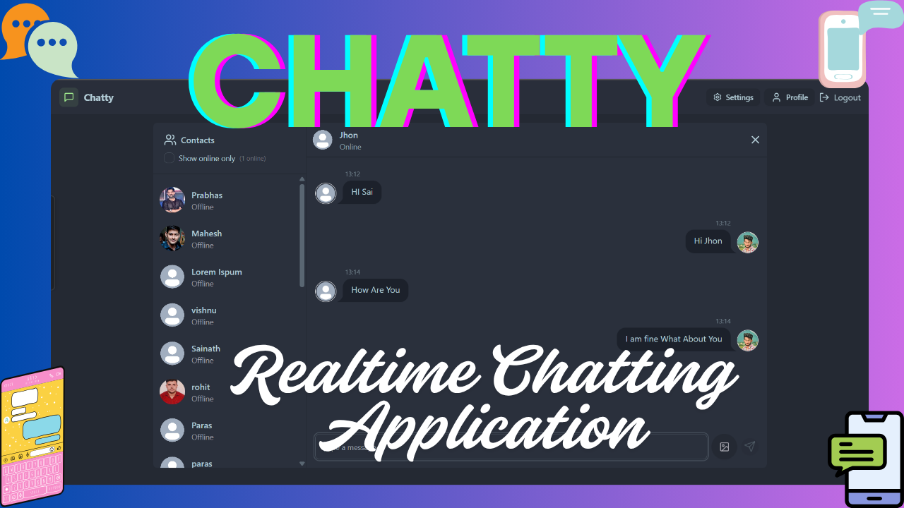
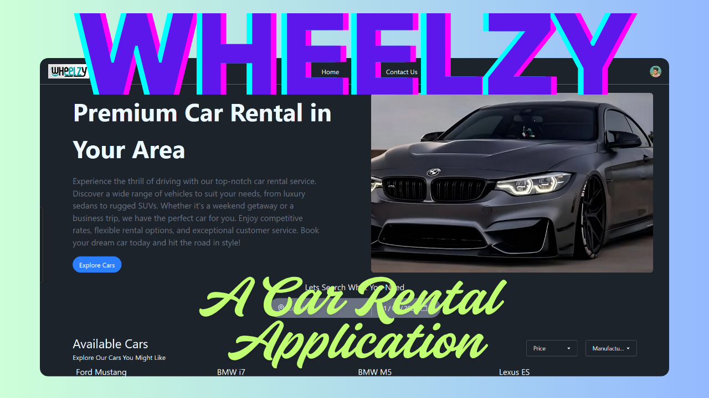
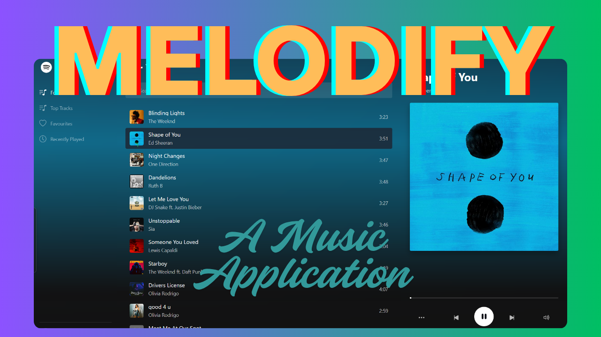
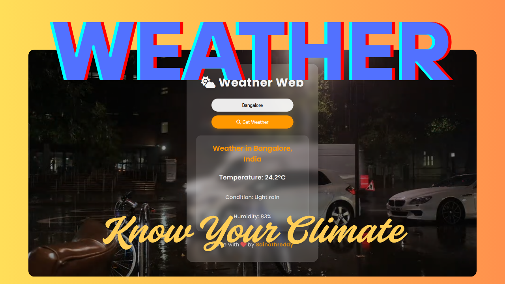

# 🚀 Personal Portfolio Website

This is a modern, responsive personal portfolio website built with **React** and **Vite**. It showcases my projects, skills, resume, and contact information in a clean and interactive UI. The site is optimized for both desktop and mobile devices.

## ✨ Features

- **Project Showcase:** Interactive cards with screenshots, tech stack, highlights, and live/demo links for each project.
- **Skills Section:** Visual display of technical skills with SVG icons and color coding.
- **About & Resume:** Brief introduction and downloadable resume.
- **Contact Form:** Easy way for visitors to reach out.
- **Responsive Design:** Looks great on all screen sizes.
- **Modern Stack:** Built using React, Vite, Tailwind CSS, and more.

## 🛠️ Tech Stack

- **Frontend:** React, Vite, Tailwind CSS, DaisyUI, SCSS, React Bootstrap
- **Icons:** React Icons, Font Awesome, Google Fonts
- **APIs:** OpenWeatherMap, WeatherAPI (for weather projects)
- **Other:** Zustand, Cloudinary, Render, Vercel

## 📁 Project Structure

- `src/components/` – All React components (Navbar, Hero, Projects, Skills, etc.)
- `src/data/` – Data files for projects, skills, education, and bot answers
- `src/assets/` – Images, SVGs, and other static assets
- `public/` – Static files (logo, favicon, etc.)

## 🚦 How to Run Locally

1. **Clone the repository:**
   ```sh
   git clone <repo-url>
   cd portf
   ```
2. **Install dependencies:**
   ```sh
   npm install
   ```
3. **Start the development server:**
   ```sh
   npm run dev
   ```
4. Open [http://localhost:5173](http://localhost:5173) in your browser.

## 🌐 Live Demo

Check out the live site: [Portfolio Live](https://your-portfolio-live-link.com)

## 📸 Example Projects

- **Chatty – Real-time Chat Application**
  
  [Live Demo](https://chatty-realtime-chatting.onrender.com)
- **Car Rental Web App**
  
  [Live Demo](https://car-rental-sai.vercel.app/)
- **Melodify – Spotify Clone**
  
  [Live Demo](https://spotify-clone-1-sai.vercel.app/)
- **Weather Forecast Applications**
  
  [Live Demo](https://sainath-666.github.io/Weather_Application_2/)

...and more! See the Projects section for details.

## 📄 License

This project is open source and available under the [MIT License](LICENSE).
